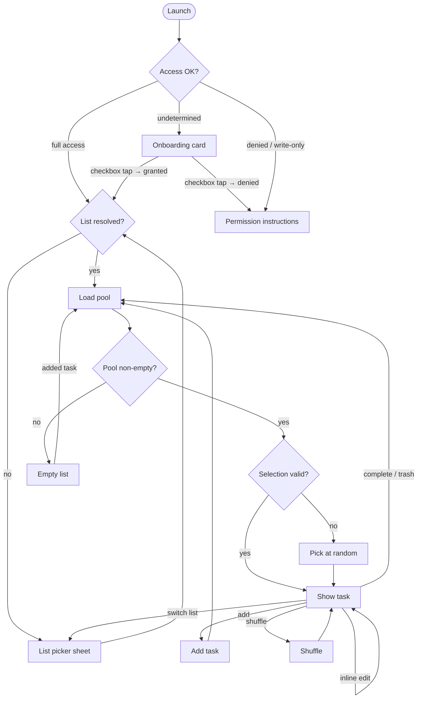
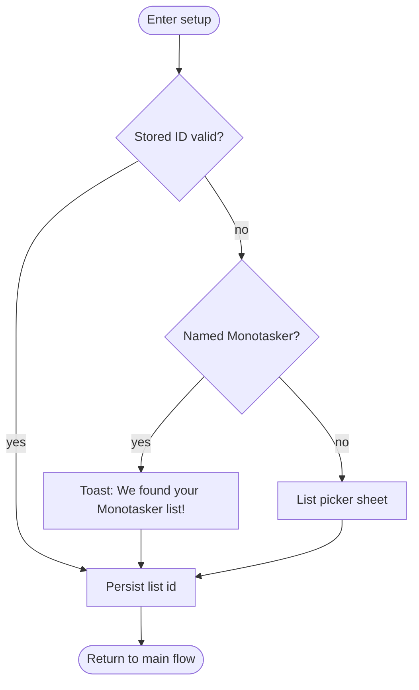

# Monotasker — plan

Canonical reference for what Monotasker is, how it works, and what's left to build. Planning artifacts and historical specs live in `docs/superpowers/`.

Links: [README](../README.md)

---

## What's next

### Ship-ready polish

- [x] **Error UX**: Friendly per-situation messages replace `localizedDescription`; alert title removed so message stands alone; load-after-add failure silenced (self-healing) but tracked; all six error sites report to TelemetryDeck.
- [ ] **Scene lifecycle**: Confirm behavior returning from background / Settings (permission changes, list edits in Reminders). `sceneDidBecomeActive` is wired; see [manual test cases](#scene-lifecycle-manual-tests) below.
- [x] **Device matrix**: Snapshot tests cover SE / iPhone 13 / 13 Pro Max × light/dark for all four phases (onboarding, permissionDenied, emptyList, focused) including long-content overflow. Remaining device-only concerns (toolbar behavior, sheet detents, keyboard interactions) are covered by scene lifecycle manual tests (T1–T6).
- [ ] **Full VoiceOver traversal order audit** + large-text layout; see [VoiceOver manual tests](#voiceover-manual-tests) below (V1–V9).
- [x] **PermissionInstructionsView copy**: iOS grants Reminders access all-or-nothing — there is no user-visible write-only state to distinguish. Current copy ("open Settings and allow Reminders access") is correct.

### Animations

Card interactions currently have no motion beyond keyboard-tracking and tilt. All three deserve distinct, characterful animations:

- [ ] **Shuffle**: card flies off one edge (or back of stack) and a new one arrives — makes the randomness feel tactile.
- [ ] **Complete**: card checkmark + satisfying exit (fold, shrink-and-fly, confetti flash — TBD).
- [ ] **Discard / trash**: card crumples or slides to trash; more dismissive than complete.
- [ ] Ensure all three gate on `accessibilityReduceMotion`.

### Swipe interactions

Consider replacing or supplementing the bottom icon strip and floating chrome with swipe gestures:

- [ ] Swipe right → complete (or shuffle — decide which maps to which direction).
- [ ] Swipe left → trash.
- [ ] Swipe up/down → shuffle.
- [ ] Evaluate whether swipe + icon strip coexist or one replaces the other; swipe affordance (rubber-band preview) so the action is discoverable.

### View and behavior refinement

- [ ] **RootView**: ensure one alert at a time if `userMessage` and another modal could conflict.
- [ ] **TaskFocusView / PostItCard**: typography hierarchy; toast placement vs keyboard and safe area; optional haptic on undo commit.
- [ ] **EmptyListView**: confirm copy and visuals match TaskFocusView metaphor.
- [ ] **In-place edit**: Done on title could save + dismiss (optional shortcut).
- [ ] **Cross-cutting**: centralize spacing / corner radius tokens; haptics optional for Complete.

### Performance remaining

- [ ] Remove `[TIMING]` instrumentation (`MonotaskerTiming.swift`, prints in `MonotaskerApp.swift` and `AppViewModel.swift`) once cold-launch is confirmed stable.

### App Store and marketing assets

**Last** — after UI and branding settle.

- [ ] Screenshots (required sizes; dark + light)
- [ ] App Store copy: subtitle, description, keywords, What's New template; align with onboarding copy for consistency
- [ ] Privacy questionnaire; Privacy Policy URL if required
- [ ] Support / marketing URLs
- [ ] App Review notes for the permission flow

---

## Manual test cases

### Scene lifecycle manual tests

These require a physical device (or simulator with real permission flow). Each test is listed with setup, steps, and expected result. Run after any change to `AppViewModel`, `MonotaskerApp`, or EventKit interaction.

**T1 — Grant permission from Settings (was permissionDenied)**
1. Fresh install or revoke Reminders access in Settings → Monotasker → Reminders = None.
2. Launch Monotasker. Tap the onboarding checkbox → deny permission when prompted.
3. Confirm app shows the ghost-card "Reminders access needed" screen.
4. Without killing the app, open Settings → Monotasker → Reminders → set to Full Access.
5. Return to Monotasker.
- **Expect**: App detects the change, runs bootstrap, transitions to the focused task screen (or list picker if no list resolved).

**T2 — Revoke permission while app is in use**
1. Launch Monotasker with full Reminders access. Confirm a task is visible.
2. Without killing the app, open Settings → Monotasker → Reminders → set to None.
3. Return to Monotasker.
- **Expect**: App transitions to the permission instructions screen. No crash, no stale task shown.

**T3 — Return from Reminders.app after editing a task**
1. Launch Monotasker. Note the task title shown.
2. Without killing the app, open Reminders.app and change the title of that task.
3. Return to Monotasker.
- **Expect**: Card updates to reflect the new title (EKEventStoreChanged fires on foreground return).

**T4 — Return from Reminders.app after deleting the current task**
1. Launch Monotasker with ≥2 tasks. Note the task shown.
2. Open Reminders.app and delete that task (not all tasks).
3. Return to Monotasker.
- **Expect**: A different task is shown; no alert about "task not found".

**T5 — Return from Reminders.app after deleting the entire list**
1. Launch Monotasker. Confirm a task is visible.
2. Open Reminders.app and delete the Monotasker list entirely.
3. Return to Monotasker.
- **Expect**: App shows the list picker (`.listSetup` phase). No crash.

**T6 — Undo window survives a brief background**
1. Launch Monotasker with ≥2 tasks.
2. Tap Trash on a task — the undo toast appears (4-second window).
3. Immediately home-screen the app and wait ~1 second, then return.
4. Observe whether the undo toast is still showing or has committed.
- **Expect**: If < 4s elapsed (wall clock), undo toast still visible. If ≥ 4s, task is gone and pool reloaded.

**T7 — EKEventStoreChanged fires after iCloud sync**
1. On Device A, launch Monotasker with a shared iCloud Reminders list.
2. On Device B (or iCloud web), add a task to the same list.
3. Wait for sync to propagate, or wait for Device A to receive the notification.
- **Expect**: Pool reloads within a few seconds; new task appears in shuffle rotation.

### VoiceOver manual tests

These require a physical device with VoiceOver enabled (Settings → Accessibility → VoiceOver). Run after any change to view structure, accessibility labels, or hints. Enable VoiceOver before launching the app; use single-finger swipe right/left to move focus, double-tap to activate.

**V1 — Onboarding traversal**
1. Fresh install (or revoke + relaunch). VoiceOver should land on the card.
- **Expect**: Focus moves in order: card title/description text → checkbox button ("Connect my Reminders"). No orphaned or unreachable elements. Checkbox hint reads aloud.

**V2 — Permission denied screen**
1. Deny permission at the onboarding prompt.
- **Expect**: Focus order: lock icon is hidden from VoiceOver → heading ("Reminders access needed") → body text → "Open Settings" button with hint. No duplicate or inaccessible elements.

**V3 — Focused task screen traversal**
1. With a task visible, swipe through all elements.
- **Expect**: Focus order: list picker button (nav bar) → task title → task notes (if present) → complete checkbox (upper-left, "Mark complete") → edit button ("Edit task") → shuffle button ("Shuffle") → trash button ("Trash"). Card tilt does not affect focus order.

**V4 — Complete and trash with undo (2+ tasks)**
1. With ≥2 tasks, double-tap Complete.
- **Expect**: Undo toast announced by VoiceOver. Focus moves to toast; "Undo" button is reachable and activatable. Toast dismisses after 4 seconds and focus returns to the new task.

2. Repeat with Trash.
- **Expect**: Same behavior.

**V5 — Add task**
1. Double-tap the add button (pencil / below card).
- **Expect**: Add card appears; focus moves to the title text field automatically. Keyboard accessible. Done/submit action reachable. "Task added." toast announced after save.

**V6 — Inline edit**
1. With a task visible, double-tap the edit button (pencil, lower-right of card).
- **Expect**: Title field becomes editable; focus moves into it. Notes field reachable by swiping. Dismiss keyboard to commit; changes reflected on card without losing focus context.

**V7 — List picker**
1. Double-tap the list picker button in the nav bar.
- **Expect**: Dropdown opens; each list name is announced with its selection state ("checked" or unchecked). Selecting a list closes the dropdown and announces the new list name or a transition. Scrim dismiss (double-tap outside) reachable.

**V8 — Empty list state**
1. Switch to a list with no tasks.
- **Expect**: Empty state message announced. Add task field or button reachable and labeled.

**V9 — Large text with VoiceOver**
1. Set text size to maximum (Settings → Accessibility → Display & Text Size → Larger Text → drag to max), then enable VoiceOver.
- **Expect**: All labels readable; no text truncated mid-word without being announced in full by VoiceOver. Card and controls remain tappable (touch targets ≥ 44 pt).

---

## Partial / in progress

- **Errors**: `userMessage` alert with friendly messages; most unrecoverable errors still OK-only.
- **Accessibility**: Reduce Motion gated, VoiceOver labels on all controls. Full traversal order audit and large-text layout testing still needed.
- **Phase transitions**: crossfades implemented; continued polish in the ship-ready pass.

---

## Deferred roadmap

- **Dark mode color pass**: Light and dark mode currently use independent palettes that feel unrelated. Goals: (a) derive dark gradient colors from the light palette; (b) make dark-mode card colors noticeably more vibrant; (c) revisit app icon for dark appearance. Do a side-by-side comparison before locking.
- **Categories**: EventKit exposes `EKCalendar` (list) but not per-reminder categories. Options: (a) use reminder notes or title prefix as a lightweight tag shown on the card; (b) wait for richer EventKit APIs; (c) maintain Monotasker-side tags in `UserDefaults` keyed by reminder id. Most likely v1 = small metadata chip on card using a prefix convention or dedicated field.
- **Nested / subtask handling**: `EKReminder` has no public parent/subtask API. Run the [sections smoke test](#sections-smoke-test) first. Long-term: decide whether to suppress likely-header tasks, expose subtask count as a badge, or wait for Apple APIs.
- **Priority**: weighting or visual priority cues.
- **Sections / grouped tasks**: see [Sections smoke test](#sections-smoke-test).
- **Due dates**: "Today / overdue only" pool filter; overdue badge; caveat — completing a recurring `EKReminder` advances it rather than removing it.
- **Recurrence**: surface cadence on card; do not delete recurring reminders.
- **Widgets / Lock Screen / Live Activities**: requires App Group entitlement, WidgetKit extension target in `project.yml`, shared `UserDefaults`, `WidgetCenter.shared.reloadAllTimelines()` call from `AppViewModel`.
- **Settings screen**: beyond list switching (appearance, haptics, selection policy).

### Sections smoke test

Before implementing any sections-aware behavior, verify what EventKit returns from a sectioned list.

1. In Reminders.app, add sections to the Monotasker list and add tasks inside each.
2. Run Monotasker and shuffle several times — note whether section header names appear as tasks.
3. Document findings in `EventKitRemindersService` for future contributors.

- [ ] Run manual smoke test
- [ ] Document findings
- [ ] If section headers appear: decide on filter strategy and add a unit test

---

## Done

- **Core loop**: EventKit full-access path, pool fetch, random selection + shuffle, complete, trash, inline edit, inline add, empty list, list setup, persisted list + reminder ids.
- **Complete / trash UX**: deferred with undo toast for 2+ task pool; immediate for single-task pool. No confirmation alert.
- **Add feedback**: "Task added." toast after successful add.
- **All phases**: `AppPhase` and `RootView` switch, including `onboarding`.
- **First-run onboarding**: single-card-with-checkbox flow; permission gating; list auto-selection toast; list picker for cases B/C; empty-list inline edit; smooth fade-on-tap transition before permission dialog.
- **Permission denial UI**: `PermissionInstructionsView` — ghost card with dashed border, lock icon, "Open Settings" button.
- **Only-one-task alert**: with "Add another" / "Stay here".
- **External changes**: `EKEventStoreChanged` subscription reloads pool/focus; 500 ms debounce via `externalChangeDebounceTask` coalesces rapid iCloud sync bursts into a single reload.
- **Per-list reminder memory**: 50-entry LRU map in `SelectionStore`; one-time migration from legacy format.
- **Analytics**: TelemetryDeck (pseudonymous — SHA-256 hashed per-install UUID, no PII); all core + onboarding events wired; deferred init post-first-frame to stay off cold-launch path.
- **Accessibility — Reduce Motion**: all animations gated; card tilt off; toasts VoiceOver-accessible.
- **Tests**: 104 tests across 14 groups; all passing.
- **App icon**: light, dark, and tinted variants via Icon Composer.
- **Branding**: gradient palette and post-it personality locked.
- **App category**: `public.app-category.productivity`.
- **Inline add**: add card appears in TaskFocusView (replaces bottom sheet); EmptyListView auto-opens edit on appear.
- **List picker dropdown**: nav-bar title button opens `ListPickerDropdownView` overlay (replaces bottom sheet); scrim dismiss; keyboard-aware positioning.
- **Keyboard-stable card positioning**: card stays fixed while keyboard animates; equidistant between nav bar and keyboard top using `PostItCardLayout.cardRatio`.
- **Add-card color distinctness**: add card always uses a different palette entry than the current front card.
- **Cold-launch fix**: `observationTask` deferred to post-permission (accessing `Notification.Name.EKEventStoreChanged` before `remindd` was running blocked the main actor for 30+ seconds on fresh install). TelemetryDeck also moved off `App.init()` critical path.

---

## Reference

### Decisions locked

- **App name**: `Monotasker`. Centralized via `AppConfig.appName` / `CFBundleDisplayName`. Default Reminders list title follows the app name.
- **Deployment target**: iOS 18+. Uses `requestFullAccessToReminders`. `writeOnly` access is treated as insufficient and routed to permission instructions (full read access is required).
- **Random pool (v1)**: all incomplete reminders in the chosen list. Public EventKit does not expose parent/subtask relationships on `EKReminder`, so subtasks cannot be filtered at fetch time without private APIs. **Sections** in Reminders.app are a visual concept — all reminders in a list are fetched flat. Whether section "header" tasks appear in `EKReminder` results is unknown; see [Sections smoke test](#sections-smoke-test) before any sections-aware work.
- **Shuffle**: excludes the currently-selected task when the pool has ≥ 2 items; with only one task, shuffle surfaces the same task and shows the "only one task" alert.
- **Complete vs Trash**: Complete sets `isCompleted = true`; Trash removes via `EKEventStore.remove`. With **2+** tasks, both actions defer and show a **toast with Undo**; after the window expires the action commits. With **1** task, both apply immediately. No separate confirmation alert — undo covers mistaken taps.
- **Edit (v1)**: inline on the post-it (title and notes), not a separate sheet. No public URL to open a specific reminder in the system Reminders app.
- **Add task**: a control is always available on the main focus path (including empty list flows).
- **Scaffolding**: xcodegen keeps the Xcode project reproducible; `Monotasker.xcodeproj` is checked in for clone-and-open.
- **Branding**: App icon (Icon Composer, light/dark/tinted), gradient palette, and post-it personality are locked.
- **App category**: `public.app-category.productivity` (set in `project.yml`).

### Phase state machine

The happy path runs straight down the center: launch → permission check → list check → load pool → selection check → show task.

Diagram notes:
- `denied/writeOnly`: both treated as insufficient for read needs.
- Shuffle / random pick share `UniformRandomTopLevelPolicy`; see `RandomSelectionPolicy.swift`.
- Complete / trash returns to `LoadPool` after optional undo toast when pool had 2+ tasks.
- `listSetup` phase shows the card-stack background with an auto-presented list picker dropdown — not a dedicated screen.

#### List resolution (zoomed in)

Reached after permission granted, when the stored list vanished, or when the user taps the list picker.

- Lists come from all sources the device exposes (iCloud, local, Exchange, etc.).
- New list title is `AppConfig.appName`; source prefers `defaultCalendarForNewReminders()`, then CalDAV, then first available.
- Resolution order: persisted list id first, then first list whose title matches `AppConfig.appName`. Choice stored in `SelectionStore`.

### Architecture

- **UI**: SwiftUI, `@main` app, `@Observable` view model.
- **State**: `AppViewModel` owns `AppPhase` (`bootstrapping`, `onboarding`, `permissionDenied`, `listSetup`, `emptyList`, `focused`), pool, current `ReminderTask`, sheets, alerts, and undo state.
- **Reminders**: `RemindersService` protocol; `EventKitRemindersService` for device (lazy `EKEventStore` — not initialized until first use); `MockRemindersService` for tests.
- **Persistence**: `SelectionStore` (`UserDefaults`) — list id + per-list LRU map (up to 50 entries) of last focused reminder id per list. One-time migration from legacy single-key format on first launch after upgrade.
- **Analytics**: `AnalyticsService` protocol; `TelemetryDeckAnalyticsService` for production (initialized post-first-frame via `.task`); `MockAnalyticsService` for tests. Injected optionally into `AppViewModel`.
- **External changes**: `EKEventStoreChanged` triggers reload so edits from the Reminders app stay consistent. Observer starts lazily after permissions confirmed.

#### Random selection

`UniformRandomTopLevelPolicy` implements uniform random choice with optional "excluding" id for shuffle. When excluding removes all candidates (single-task pool), the policy falls back to the full pool and the UI shows the "only one task" flow.

#### Add-task surfacing rule

Behavior depends on pool size when add started:
- **0** in pool → focus the new task.
- **1** → focus the new task (including "Add another" from the only-one alert).
- **2+** → keep current task; the new reminder joins the pool silently.

Implemented via `poolSizeWhenAddOpened` in `AppViewModel`.

#### Visual design

- Gradient background + post-it card (`PostItCard`, `DesignColors` with asset + RGB fallbacks).
- Focus screen: **bottom icon strip** (shuffle, trash), **floating chrome** on/near the card (complete — upper-left checkbox; edit — bottom-right pencil; add — below lower-right corner); navigation bar holds the **list picker button** (opens a sheet).
- Post-action **toasts**: undo for complete/trash (multi-task pool), "Task added." after add, "We found your Monotasker list!" with "Change" after onboarding auto-selection. All VoiceOver-accessible.
- **Reduce Motion**: all animations gate on `accessibilityReduceMotion`; card tilt disabled when on.

#### Source layout

| Directory | Purpose |
|---|---|
| `Monotasker/App/` | `@main` entry point, `AppConfig` |
| `Monotasker/Models/` | `ReminderTask` — domain model wrapping `EKReminder` |
| `Monotasker/Services/` | `RemindersService` protocol + EventKit/mock implementations |
| `Monotasker/State/` | `AppViewModel`, `SelectionStore` |
| `Monotasker/Selection/` | `UniformRandomTopLevelPolicy` |
| `Monotasker/Views/` | All SwiftUI views |
| `Monotasker/Resources/` | `DesignColors`, asset catalogs |
| `MonotaskerTests/` | Unit tests (selection policy, selection store, view model) |

#### Renaming the app

1. Update `CFBundleDisplayName` in `Info.plist` or via `project.yml`.
2. Optionally change bundle id / target name in `project.yml`.
3. Run `xcodegen generate`.
4. Existing installs keep their chosen list id; new installs see the new default list name.

---

## Maintenance

- Keep this file in sync when core behaviors change (phases, surfacing rules, EventKit assumptions, instrumentation events).
- Regenerate the xcodegen project after `project.yml` edits; commit intentional `.pbxproj` updates.
