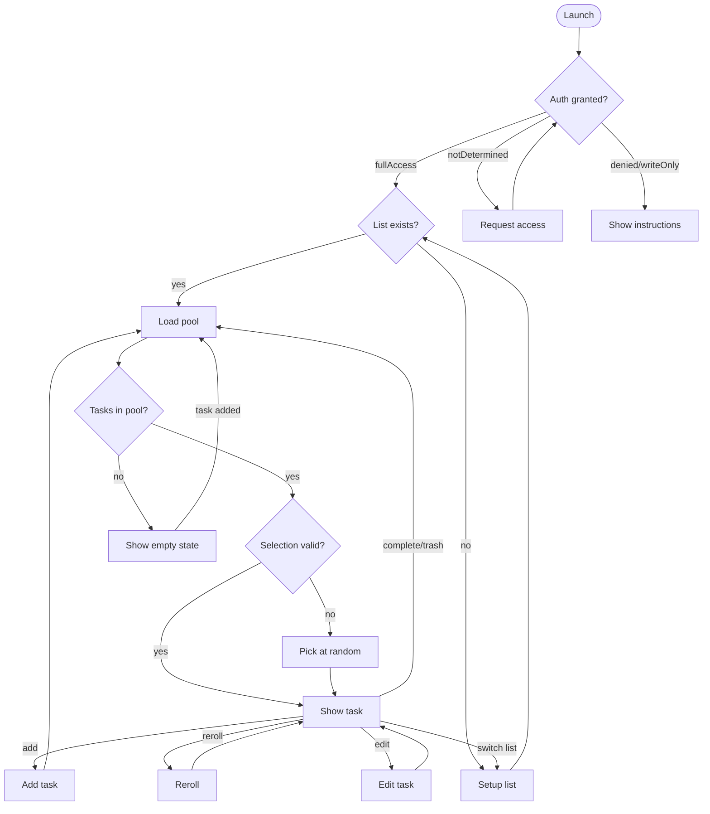
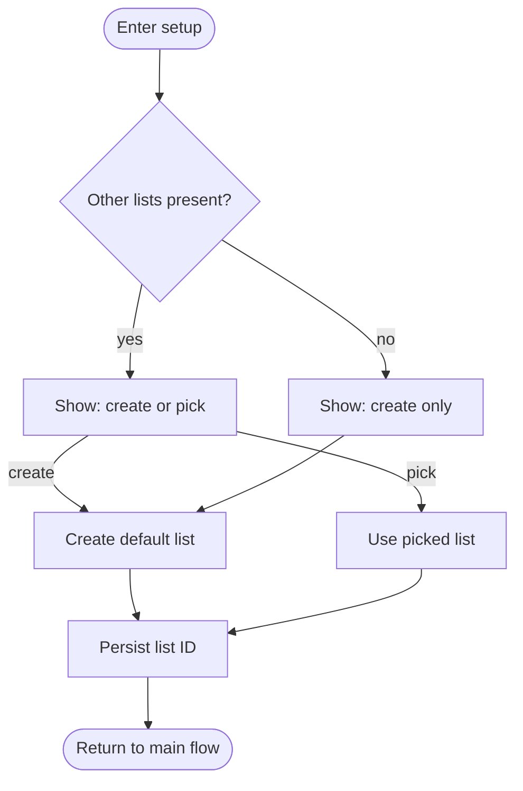

# Monotask — product plan

This document is the canonical plan for the app. For actionable checklists, see [TASKS.md](TASKS.md).

## Overview

An iOS 18+ SwiftUI app that surfaces one randomly-selected incomplete reminder at a time from a chosen Apple Reminders list, with permission gating, list resolution, and a post-it-on-gradient single-task UI. Built on EventKit, xcodegen (`project.yml`), and an `@Observable` state model with a protocol-wrapped Reminders service for testability.

## Decisions locked

- **App name**: `Monotask`. Centralized via `AppConfig.appName` / `CFBundleDisplayName`. Default Reminders list title follows the app name.
- **Deployment target**: iOS 18+. Uses `requestFullAccessToReminders`. `writeOnly` access is treated as insufficient and routed to instructions (full read access is required).
- **Random pool (v1)**: all incomplete reminders in the chosen list (public EventKit does not expose parent/subtask relationships on `EKReminder`, so subtasks cannot be filtered at fetch time without private APIs).
- **Re-roll**: excludes the currently-selected task when the pool has ≥ 2 items; with only one task, re-roll surfaces the same task and may show the “only one task” alert with “Add another” / “Stay here”.
- **Complete vs Trash**: Complete sets `isCompleted = true`. Trash removes the reminder via `EKEventStore.remove`.
- **Edit (v1)**: in-app sheet for title and notes. No supported public URL to open a specific reminder in the system Reminders app ([discussion](https://stackoverflow.com/questions/78688263/how-to-open-a-reminders-app-reminder-item-using)).
- **Add task**: a control is always available on the main focus path (including empty list flows).
- **Scaffolding**: xcodegen keeps the Xcode project reproducible; `Monotask.xcodeproj` is checked in for clone-and-open.

## Deferred roadmap

Longer-term ideas live in [TASKS.md — Deferred / roadmap](TASKS.md#deferred--roadmap) so this section stays a short index:

- Animations and gestures (replace or augment the labeled button row).
- Priority, due dates, recurrence UI, subtasks (if Apple exposes stable APIs).
- App icon, richer settings, widgets / Live Activities.
- See TASKS.md for the full list.

## High-level state machine

The happy path runs straight down the center: launch, permission check, list check, load pool, selection check, show task. Side branches return to the spine.

Diagram notes:

- `denied/writeOnly`: both insufficient for our read needs.
- `Reroll` / random pick share the same uniform policy; see code in `RandomSelectionPolicy.swift`.
- **Setup list** (create default list vs pick existing) is detailed below.

### Setup list (zoomed in)

Reached on first run, when the stored list vanished, or when the user chooses “Switch list”.

- Lists come from all sources the device exposes (iCloud, local, Exchange, etc.).
- New list title is `AppConfig.appName`; source prefers `defaultCalendarForNewReminders()`, then CalDAV, then first available.
- **Resolution order**: persisted list id first, then a list whose title matches `AppConfig.appName`. Choice is stored in `SelectionStore`.

## Architecture (implementation)

- **UI**: SwiftUI, `@main` app, `@Observable` view model.
- **State**: `AppViewModel` owns `AppPhase`, pool, current `ReminderTask`, sheets, and alerts.
- **Reminders**: `RemindersService` protocol; `EventKitRemindersService` for device; `MockRemindersService` for tests.
- **Persistence**: `SelectionStore` (`UserDefaults`) for list id and last focused reminder id.
- **External changes**: `EKEventStoreChanged` triggers reload so edits from the Reminders app stay consistent.

## Random selection

- `UniformRandomTopLevelPolicy` implements uniform random choice with optional “excluding” id for re-roll.
- When excluding removes all candidates (single-task pool), the policy falls back to the full pool and signals the UI to show the gentle “only one task” flow.

## Add-task surfacing rule

When add completes, behavior depends on **pool size at the moment add started**:

- **0** in pool → focus the new task.
- **1** → focus the new task (including “Add another” from the only-one alert).
- **2+** → keep the current task focused; the new reminder joins the pool.

Implemented in `AppViewModel` (`poolSizeWhenAddOpened`).

## Visual design (v1)

- Gradient background + post-it card (`PostItCard`, `DesignColors` with asset + RGB fallbacks).
- Labeled icon buttons on the focus screen; gestures deferred.
- Reduce Motion respects accessibility settings for tilt.

## Renaming the app

1. Update `CFBundleDisplayName` in `Info.plist` or via `project.yml`.
2. Optionally change bundle id / target name in `project.yml`.
3. Run `xcodegen generate`.
4. Existing installs keep their chosen list id; new installs see the new default list name behavior.

## Source layout (reference)

See the repository; primary groups are `App/`, `Models/`, `Services/`, `State/`, `Selection/`, `Views/`, `Resources/`, and `MonotaskTests/`.
