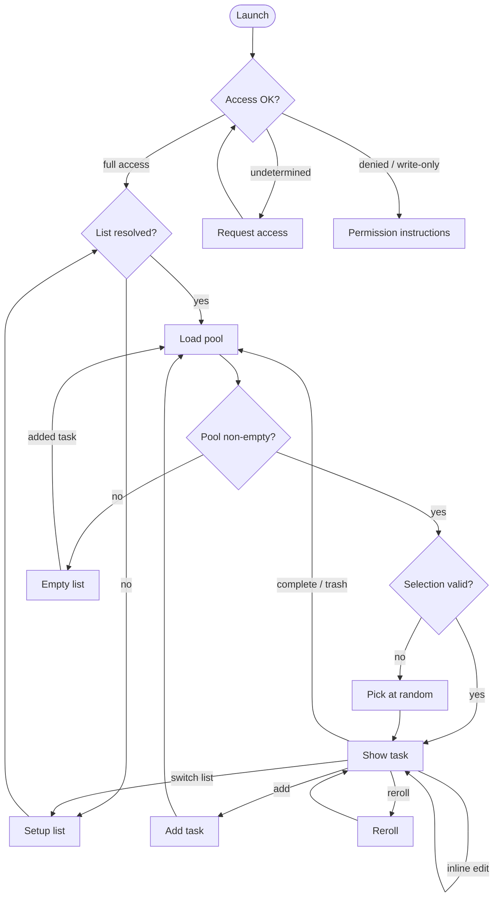
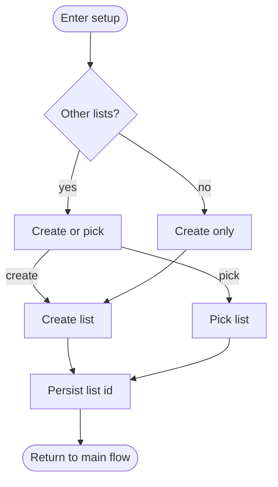

# Monotask — product plan

This document is the canonical plan for the app. For actionable checklists and **implementation order** (branding → instrumentation → a11y → onboarding → performance → App Store last), see [TASKS.md](TASKS.md). For the proposed **first-run onboarding** (permission funnel, not built yet), see [ONBOARDING.md](ONBOARDING.md).

## Overview

An iOS 18+ SwiftUI app that surfaces one randomly-selected incomplete reminder at a time from a chosen Apple Reminders list, with permission gating, list resolution, and a post-it-on-gradient single-task UI. Built on EventKit, xcodegen (`project.yml`), and an `@Observable` state model with a protocol-wrapped Reminders service for testability.

## Decisions locked

- **App name**: `Monotask`. Centralized via `AppConfig.appName` / `CFBundleDisplayName`. Default Reminders list title follows the app name.
- **Deployment target**: iOS 18+. Uses `requestFullAccessToReminders`. `writeOnly` access is treated as insufficient and routed to instructions (full read access is required).
- **Random pool (v1)**: all incomplete reminders in the chosen list (public EventKit does not expose parent/subtask relationships on `EKReminder`, so subtasks cannot be filtered at fetch time without private APIs). **Sections** in Reminders.app are a visual concept — from EventKit's perspective, all reminders in a list are fetched flat regardless of how they appear in the UI. It is unknown whether section "header" tasks appear in `EKReminder` results (and if so, whether we want them in the pool). This needs a manual smoke test before any sections-aware filtering is attempted.
- **Re-roll**: excludes the currently-selected task when the pool has ≥ 2 items; with only one task, re-roll surfaces the same task and may show the “only one task” alert with “Add another” / “Stay here”.
- **Complete vs Trash**: Complete sets `isCompleted = true`. Trash removes the reminder via `EKEventStore.remove`. When there are **two or more** tasks in the pool, both actions **defer** talking to EventKit briefly and show a **toast with Undo** (`beginComplete` / `beginDelete` in `AppViewModel`); after the window expires (or if the user does not undo), the action is committed. With **only one** task, complete/trash apply **immediately** (no undo window). There is **no separate confirmation alert** — undo covers mistaken taps when multiple tasks exist.
- **Edit (v1)**: **inline** on the post-it (title and notes), not a separate sheet. No supported public URL to open a specific reminder in the system Reminders app ([discussion](https://stackoverflow.com/questions/78688263/how-to-open-a-reminders-app-reminder-item-using)).
- **Add task**: a control is always available on the main focus path (including empty list flows).
- **Scaffolding**: xcodegen keeps the Xcode project reproducible; `Monotask.xcodeproj` is checked in for clone-and-open.
- **Branding before first-run polish**: App **icon**, gradient/post-it **personality**, and overall look should be decided before final onboarding visuals. The onboarding flow and wiring are done with a placeholder visual ([TASKS.md — Branding](TASKS.md#branding--visual-identity)).
- **Instrumentation**: **Daily-use** analytics wired via **TelemetryDeck** (pseudonymous — hashed per-install UUID, no PII). Core events: `app.foreground`, `task.complete`, `task.delete`, `task.undo`, `task.reroll`, `task.add`, `list.switch`, `permission.outcome`, `error.critical`. Onboarding funnel events in ONBOARDING.md share the same pipe when implemented.

## First-run onboarding (planned)

Not implemented in code yet. **Goal**: screens + copy before the system Reminders permission so more users grant **full** access; optional instrumentation for drop-off. **Order**: settle **branding** first, then build splash/onboarding ([TASKS.md — Suggested implementation order](TASKS.md#suggested-implementation-order)). Spec and references: [ONBOARDING.md](ONBOARDING.md). Track tasks under [TASKS.md — First-run onboarding](TASKS.md#first-run-onboarding).

## Deferred roadmap

Longer-term ideas live in [TASKS.md — Deferred / roadmap](TASKS.md#deferred--roadmap) so this section stays a short index:

- Animations and gestures (replace or augment the bottom / floating action pattern).
- Priority, due dates, recurrence UI, subtasks (if Apple exposes stable APIs).
- **Sections / grouped tasks**: surface or filter by section once the smoke test clarifies EventKit's behavior.
- **Widgets / Lock Screen / Live Activities**: requires App Group for shared UserDefaults, WidgetKit timeline, and read-only EventKit access from the extension — see TASKS.md for the full checklist.
- **Due dates**: filter pool or add overdue styling; test against EventKit's recurrence next-instance behavior before committing to a design.
- **App Store distribution** (icon, screenshots, metadata): **after** UI and branding stabilize — see [TASKS.md — App Store and marketing assets](TASKS.md#app-store-and-marketing-assets).
- See TASKS.md for the full list.

## High-level state machine

The happy path runs straight down the center: launch, permission check, list check, load pool, selection check, show task. Side branches return to the spine.

Mermaid cannot pin arrow attachment points (e.g. enter-only-at-top) or label position along an edge; the layout below uses `**curve: basis`** for smooth bends, `**TB`** as the only dominant direction, **happy-path edges declared first** as one vertical chain, and **short arrow labels** so legibility is closer to the source node. Rendering still varies by viewer version.

Diagram notes:

- `denied/writeOnly`: both insufficient for our read needs.
- `Reroll` / random pick share the same uniform policy; see code in `RandomSelectionPolicy.swift`.
- **Complete / trash**: In code, returning to `LoadPool` follows **toasts and optional undo** when the pool had multiple tasks; the diagram omits that detail.
- **Setup list** (create default list vs pick existing) is detailed below.

### Setup list (zoomed in)

Reached on first run, when the stored list vanished, or when the user chooses “Switch list”.

- Lists come from all sources the device exposes (iCloud, local, Exchange, etc.).
- New list title is `AppConfig.appName`; source prefers `defaultCalendarForNewReminders()`, then CalDAV, then first available.
- **Resolution order**: persisted list id first, then a list whose title matches `AppConfig.appName`. Choice is stored in `SelectionStore`.

## Architecture (implementation)

- **UI**: SwiftUI, `@main` app, `@Observable` view model.
- **State**: `AppViewModel` owns `AppPhase`, pool, current `ReminderTask`, sheets, alerts, and undo state.
- **Reminders**: `RemindersService` protocol; `EventKitRemindersService` for device; `MockRemindersService` for tests.
- **Persistence**: `SelectionStore` (`UserDefaults`) — list id + per-list LRU map (up to 50 entries) of last focused reminder id per list. Migrates legacy single-key format on first launch after upgrade.
- **Analytics**: `AnalyticsService` protocol; `TelemetryDeckAnalyticsService` for production (hashed install UUID); `MockAnalyticsService` for tests. Injected optionally into `AppViewModel`.
- **External changes**: `EKEventStoreChanged` triggers reload so edits from the Reminders app stay consistent.

## Random selection

- `UniformRandomTopLevelPolicy` implements uniform random choice with optional “excluding” id for re-roll.
- When excluding removes all candidates (single-task pool), the policy falls back to the full pool and signals the UI to show the gentle “only one task” flow.

## Add-task surfacing rule

When add completes, behavior depends on **pool size at the moment add started**:

- **0** in pool → focus the new task.
- **1** → focus the new task (including “Add another” from the only-one alert).
- **2+** → keep the current task focused; the new reminder joins the pool.

Implemented in `AppViewModel` (`poolSizeWhenAddOpened`).

## Visual design (v1)

- Gradient background + post-it card (`PostItCard`, `DesignColors` with asset + RGB fallbacks).
- Focus screen: **bottom icon strip** (re-roll, add, trash), **floating chrome** on the card (edit upper area, complete on the card); navigation bar holds the **list picker**. Gestures for actions deferred. Older docs called this an “action row”; **TASKS.md** uses strip + floating chrome + list picker for clarity.
- Post-action **toasts**: undo for complete/trash (multi-task pool), brief confirmation after add. Toast is VoiceOver-accessible (button trait + hint) when it carries an action.
- **Reduce Motion**: all animations in `RootView` and `TaskFocusView` gate on `accessibilityReduceMotion`; card tilt disabled when reduce motion is on (`PostItCard`).

## Renaming the app

1. Update `CFBundleDisplayName` in `Info.plist` or via `project.yml`.
2. Optionally change bundle id / target name in `project.yml`.
3. Run `xcodegen generate`.
4. Existing installs keep their chosen list id; new installs see the new default list name behavior.

## Source layout (reference)

See the repository; primary groups are `App/`, `Models/`, `Services/`, `State/`, `Selection/`, `Views/`, `Resources/`, and `MonotaskTests/`.